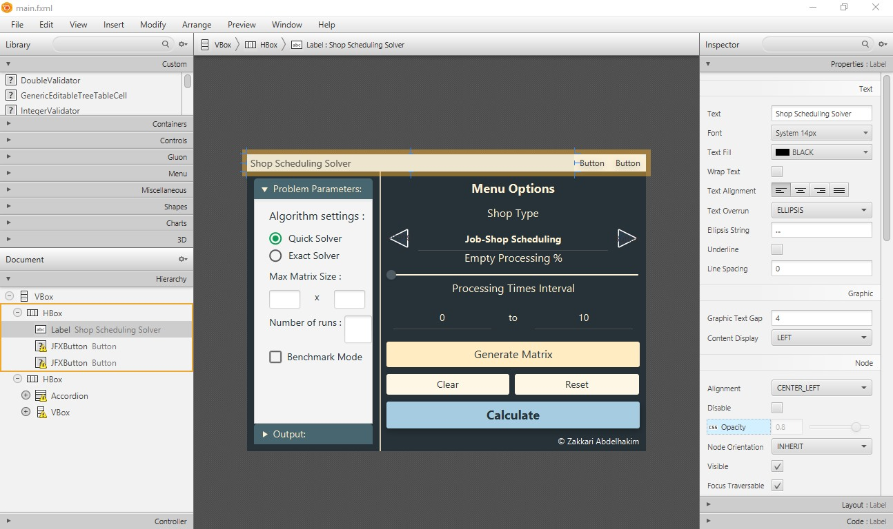
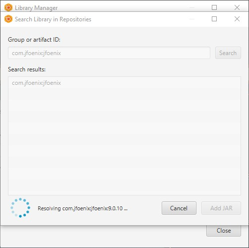
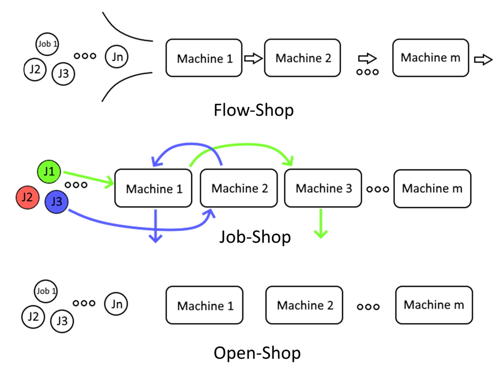
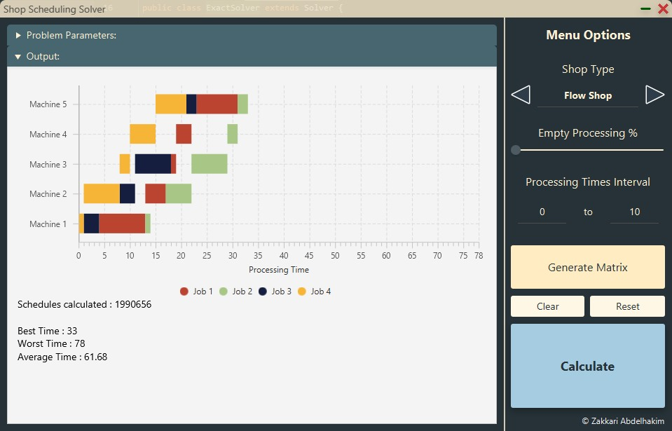

Interface
=========

The rendering in Shop Solver is done through JavaFX. The typical structure for a JavaFX project is done through a master “Controller” class, and a “FXML” file that provides bindings to a single instance of this class, separate from the code application logic.

### FXML

The file located under resources/main.fxml represents the main layout of the application interface. In order to make modifications to the interface one can either modify the file directly, or do it through the Scene Builder interface.

**N.B : The layout has elements and dependencies that are not present in the default JavaFX 11 library, so in order to correctly display them you should first import the latest JFoenix version into Scene Builder.**

All the static files such as CSS, images, etc… are stored within the same resources/ folder. So they are referenced relative to the root of this folder.

As mentioned earlier, the FXML is only the skeleton of the UI layout. It holds a reference to the Controller class which is the one in charge of the remaining code logic such as dynamically rendering the input matrices, available algorithm types, and solution results.

### Controller

The Controller class holds references to all the FXML elements outlined above, which will be annotated with the `@FXML` annotation, and loaded through the FXML Loader on initialization.

**Adding a new Solver algorithm :**

It’s fairly simple to add a new solver to the list displayed in the UI :

Simply add your class type and algorithm name to the line above. Since all solvers are children of the abstract Solver class, the Controller easily plugs into the declared methods for them.

**Problem Types :**

In order to understand the matrix interface, a quick definition of the problem is in order. The Shop Solver helps solve the three existing types of optimization problems: Job-Shop, Flow-Shop, and Open-Shop scheduling problems.

In Job-Shop scheduling, we are given n jobs of varying processing times, within each job there is a set of operations which need to be scheduled on m machines with varying processing power, while trying to minimize the makespan, the total length of the schedule. Each operation has a specific machine that it needs to be processed on and only one operation of a job can be processed at a given time.

Flow-Shop Scheduling follows the same definition, except that all the jobs’ operations have a strict order they need to follow.

Open-Shop problems on the other hand, have no restrictions on operation orders, it is completely arbitrary.

The UI provides a selector to choose which problem type the matrix represents. The matrix representation is simple, as each cell represents the processing time of Operation ij, with i being the machine index, and j being the job index.
The interface will also change specifically for the Job-Shop scheduling problem representation, since in addition to the processing times of each operation, the order in which the operations have to go through are also provided in the problem definition.

**Random generator :**

The sidebar is used to generate problem instances for each type of the problems. The generation is done through a uniform distribution, through the Problem class constructor. In addition to the problem type, the parameters on the sidebar also include the desired interval of processing times, and the percentage of “zero” time operations.
A zero-time operation is effectively a non-operation where the job does not need to be processed on a specific machine, please refer to the scientific article on details on why this is represented in this way.

**Job Chart :**

The rendering of the schedules is done through a custom class that extends the JavaFX Chart class. It's written from scratch and organizes the operations by machines, color coded for each Job.

The solver currently displays the best solution, while aggregating the base data for other solutions returned by the heuristic algorithms (Schedules in the result set, Best/Worst/Average makespan times). 

**Benchmark mode :**

While the Controller class manages the UI on the main thread, it also offloads solving to a new thread, which is detailed in the next section.

**Error management :**

The Controller class also provides Error handling off the cuff. If any Solver throws, either the stack trace, or a custom message is displayed through the onFailed Event handler.
