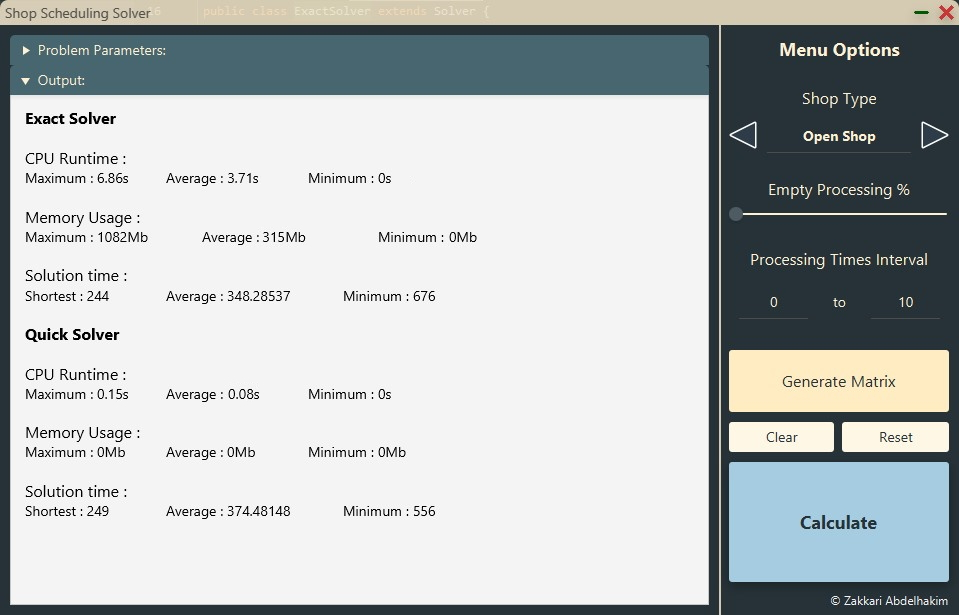
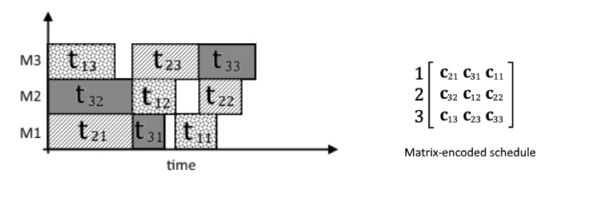

Solving
=======

A Solver is a class that has the adequate methods to solve either one or multiple types of the Shop Scheduling problems. The base Solver class is an abstract class. 
To answer the question on why I chose to use an Abstract class instead of an interface:

- A base Solver class provides a ready-to-go structure for newer algorithms to build on, to benefit from the GUI interface, from the background threading code, and from common utility methods. Since abstract classes can have bodies, any computation method that could be used across multiple solvers (like the existing cartesian multiplication, schedule permutation and parsing, etc...) can be added to the abstract class. This cannot be achieved with Interfaces.

- All future solvers will improve from improvements on the computational methods, and on the multithreading code. If any of the methods I mentioned above are improved, every inheriting solver will have a performance boost. It is also true that this is a double-edged sword, as changes in these methods might also cause breakage down the children. But that is why we have test suites.

- An interface-based design is a lot harder to maintain from a codebase perspective. If I were to rewrite the code to use interfaces, it would be built on multiple child interfaces, not a single one. Which means future contributions might choose to implement specific interfaces and not others, then as future iterations of those newly made classes create new children, it multiplies the workload required in the testing suites, multithreading management, and UI-related management. With an abstract class, all future classes and their subsequent children are all managed through a single structure.

- I already coded the abstract class with the future flexibility in mind. The solver method not only allows the algorithm to return a single optimal solution, but a list of solutions. This is obviously useful for heuristic algorithms, like Ant Colony Optimisation, or genetic/evolutionary algorithms, that work with populations.

The Solver class also extends the JavaFX.concurrent.Service class, this class provides the encapsulation around the solving process, allowing us to run it in the background, but also make use of thread management calls.

### Multi-threading

While the software currently doesn’t yet make use of multi-threading for single solver algorithms, it does for the benchmark mode which is more useful in accurately measuring the performance of Solvers. The benchmark mode runs a few warm-up runs, then as many runs as the user input demands on the same loop. It instantiates a new thread for each iteration and collects results across these runs : Average runtime, CPU Usage, Memory Usage, and obviously solution quality.

### Problem Encoding

While a schedulesis independent of encoding scheme, it’s necessary for the latter to be efficient as in a real-life application, it directly relates to algorithm performance. One of the most common encoding schemes for shop scheduling problems is an ordered list of all operations.

In an optimal solution encoding, as the processing times are included in the input, we only need to store completion times (Cji) to be able to re-draw a full schedule. Here is an example of an arbitrary problem solution, and how it would be encoded as a matrix : 

For visibility, each matrix row is the machine index, and the columns are the operations. Matrix encoding is a valid way to represent a solution, but from an algorithmic standpoint, it is still an expensive data structure compared to a single ordered list, also called permutation list.

    {c21, c31, c11, c32, c12, c22, c13, c23, c33}

From this structure we can re-create the schedule drawn above, as machine and job precedence constraints are all implied from the order of insertion. We go into more detail about this encoding choice in the scientific article.