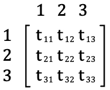
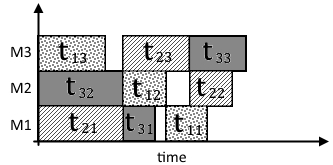
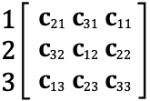

# Introduction

Scheduling problems are combinatorial sequencing problems that involve organizing a set of job operations across a finite number of machines. This type of problem is widely encountered in industrial production processes, and while some types are more common than others, all types of scheduling problems with a sufficiently large set of jobs and machines are NP-Hard. 

There are generally many optimization goals in the literature for scheduling problems, but the optimization goal of our software is minimizing makespan. The makespan is the total processing time of any given schedule. Due to the NP-Hardness of the problem, the only exact solution so far to finding its minimum value is an exhaustive iteration of every schedule combination. This is simply not feasible with most current CPUs for sufficiently large problems. So, while our software still includes an exact solver for educational and research purposes for machines with available computation power, there is also a "quick" solver algorithm, for a relatively fast heuristic algorithm with highly accurate solving rate. But the main goal of this software was to provide an open-source framework, for researchers and developers to write their own implementations for any of the three scheduling problems explained below. 

Our software is written in Java, and provides a simple structure for researchers to build upon. It also provides a visual interface for single solvers to display results, and a benchmark function that can run across multiple threads, multiple solvers on multiple problem matrices, with an output comparing CPU usage, Memory usage, and solution quality across all iterations.

# Problem definition

There are three types of scheduling problems : Flow-shop, job-shop, and open-shop scheduling. Each one of them has many subsets and variations, (which are generally quite more complex, making them prone to anomalies and edge cases [@Panwalkar2020; Rustogi2013]) but we are going to restrict the scope of our definition at problems with fixed, known-beforehand processing times, that will execute on a single available machine, with no setup-times, due dates or release dates. They remain NP-hard problems even with these constraints [@applegate1991computational].

We have a set of $n$ jobs $J_1, J_2, ..., J_n$. Within each job there is a set of operations $O_1, O_2, ..., O_m$ that need to be executed on $m$ machines $M_1, M_2, ..., M_m$. These different types of problems have the optimization objective, and some constraints in common:

$\textbf{Indices :}$

$i, l$, machine indices: $i, l = 1,2,...,m$.

$j, h$, job indices: $j, h = 1,2,...,n$.

$\textbf{Parameters :}$

$n$ : total number of jobs.

$m$ : total number of machines (subsequently, operations).

$t_{ji}$ : processing time of $j$ job on $i$ machine.

$\textbf{Decision variables :}$

$c_{ji}$ : completion time of $O_{ji}$.

The optimization objective is minimizing makespan, defined as $Cm$. The makespan is the completion time of the last operation of a schedule.

$$\bf{\min Cm = \max\limits_{0 < i,j < m,n} \{c_{ji}\}}\tag{1}$$

$$t_{ji} \geq 0, \forall i,j\tag{2}$$

$$c_{ji} \geq t_{ji}, \forall i,j\tag{3}$$

$$[c_{hi} - c_{ji} \geq t_{hi}] \lor [c_{ji} - c_{hi} \geq t_{ji}], \forall i,j,h \tag{4}$$

$$[c_{jl} - c_{ji} \geq t_{jl}] \lor [c_{ji} - c_{jl} \geq t_{ji}], \forall i,j,l \tag{5}$$

$(2)$ is a non-negative constraint for processing times. $(3)$ sets the minimum completion time for each operation. $(4) - (5)$ respectively guarantee that no two operations on the same machine overlap, and that no two operations of the same job are processed at the same time.

Other researchers [@bai2016flexible; @sun2015bayesian] have similarly defined models for specific shop types, but the constraints above are common across all scheduling problems. Each type of scheduling problem then has different precedence constraints: 

$\textbf{Flow Shop:}$

$$ c_{ji} \geq t_{ji} + c_{j(i - 1)},\forall j,i\tag{6}$$

$\textbf{Job Shop:}$

$$x_{jil} = \left\{\begin{array}{l}
1\textrm{ if } i \textrm{ is the preceding operation of }l \cr
0\textrm{ if else}
\end{array}\right.\forall j,i,l\tag{7}$$

$$ c_{jl} \geq \sum_{l=0}^{m} x_{jil} . (t_{jl} + c_{ji}), \forall j,i,l\tag{8}$$

$\textbf{Open Shop:}$

$$\varnothing$$

$(6)$ defines the precedence constraint for the flow-shop scheduling problem. If an operation $O_{ji}$ ends at $c_{ji}$, $O_{j(i-1)}$ is forced to end before it, since all operations in a flow shop follow the same machine sequence. 

For the job-shop problem, we define in $(7)$ the binary parameter $x_{jil}$, which is true only when $Oji$ is the preceding neighbor of the operation $Ojl$. We then use that to set the completion time constraint $(8)$.

And as the open-shop problem definition implies, it has no precedence constraints. As long as the solution is within the problem constraints, any schedule is a valid open-shop schedule. 

# Solution definition

## Representation

The model defined above outlines the constraints of our optimization problem. We define $S$ as the solution space defined by these constraints, and $s$ as a single feasible solution (or schedule) belonging to this space.

While a schedule $s$ is independent of encoding scheme, it's necessary for the latter to be efficient as in a real-life application, it directly relates to algorithm performance. One of the most common encoding schemes for shop scheduling problems is an ordered list of all operations.

{ width=20% }

This is an example of a problem, in case of a job-shop, the problem input would also include precedence constraints, but for simplicity we will assume the problem in $\textrm{Figure }1$ is an open-shop problem.

This is an example of a schedule $s$, it is not necessarily optimal, but it is a feasible solution as there are no 2 operations overlapping.

In an optimal solution encoding, as the processing times are included in the input, we only need to store completion times ($c_{ji}$) to be able to re-draw a full schedule. An example encoding would be a matrix of completion times.

{ width=20% }

Note that for visibility, each matrix row is the machine index, and the columns are the operations. Matrix encoding is a valid way to represent a solution, but from an algorithmic standpoint, it is still an expensive data structure compared to a single ordered list, also called permutation list. 

$$\{ c_{21}\,,\,c_{31}\,,\,c_{11}\,,\,c_{32}\,,\,c_{12}\,,\,c_{22}\,,\,c_{13}\,,\,c_{23}\,,\,c_{33} \}$$

From this structure we can re-create the schedule drawn in $\textrm{Figure }2$, as machine and job precedence constraints are all implied from the order of insertion.

While some researchers [@naderi2010contribution] have argued that the ordered list implies redundancy, that is not necessarily true. Problem and solution definitions should always be independent of the encoding scheme used [@Garey:1990:CIG:574848], it is true that if the encoding introduces extra complexity, then it is considered a bad encoding scheme. 

The open-shop problem for example, has a very large space of feasible solutions. This is not an encoding scheme issue, as it is more of an issue with the loose constraints of the problem definition. Another issue for the shop scheduling problems are zero-processing time operations. Both these issues introduce a great deal of redundancy; regardless of the encoding scheme used.

It becomes up to the algorithm implementation to introduce execution optimizations, as we cannot remove feasible but "redundant" solutions from the problem definition. We discuss and solve these issues in detail in the following section.

## Solution space

For both exact, and heuristic shop scheduling solvers, it is very important to know the solution space and the scale of the problem. Many researchers are still trying to find better bounds for the solution space[@Smutnicki2018].

We should first mention that for our implementation, processing times that are equal to zero are simply not included in the schedule. If an operation with $t_{ji}$ has a zero-processing time, its completion time $c_{ji}$ will always be equal to the completion time of its precedent, so while it is included in the problem definition for completion; as permutations of zero-time operations are still feasible solutions; we will define special functions below to exclude any zero-time operation.

$$x_{ji} = \left\{\begin{array}{l}
1\textrm{ if } t_{ji} \neq 0\cr
0\textrm{ if else}
\end{array}\right.\forall j,i$$

$$\textrm{n}(i) = \sum_{j=0}^{n} x_{ji}$$
$$\textrm{m}(j) = \sum_{i=0}^{m} x_{ji}$$ 

$\textrm{n}(i)$ is a function that counts all the non-zero operations scheduled to run on machine $i$. Similarly, $\textrm{m}(j)$ counts non-zero operations of a specific job $j$, they will both be useful in defining the solution space below.

A loose upper bound to the solution space is the full permutation set for $m \times n$. Excluding non-zero operations we get the following definition : 

$$|S| = ( \sum_{i=0}^{m} \textrm{n}(i))\,!$$

But while that might be correct in including all possible solutions, it can be further optimized.

Since both the job-shop and flow-shop have precedence constraints for each job, we cannot permute each job's operation order, thus making the solution space for both job-shop and flow-shop problems :

$$|S|_{jobshop} = |S|_{flowshop} = \prod_{i=0}^{m} \textrm{n}(i)!$$

And since for the open shop, there are no job precedence constraints, we can sum up the solution space in the equation : 

$$|S|_{openshop} = \prod_{i=0}^{m} \textrm{n}(i)! \times \prod_{j=0}^{n} \textrm{m}(j)!$$

This expression accurately represents every open shop permutation without any redundancy. Through a Sterling approximation, and assuming $n=m$ for simplicity, we can compare it to $|S|$ :

$$\frac{|S|}{|S|_{openshop}} \approx \exp(n^2).n^{1-n}.2\pi^{1/2-n} \approx exp(n^2-n)$$

which is an exponentially better algorithm for an exact solver that iterates through the full solution space, albeit still remaining factorial in complexity.

# Conclusion and perspectives

In this paper, we outlined the similarities and differences between the three types of scheduling problems. We elaborated a linear programming model with a makespan minimization objective, and defined an encoding scheme, while improving on the upper bound of the solution space. Of course, that is just a very small subset of all the variations present in the literature of the shop scheduling problems, there are also different optimization objectives that were not in the scope of this paper.

While our software is a real-life application of the concepts above, its goal is to provide a framework for other researchers to build and improve upon. In its current state, our software is feature complete, but there is still a lot of room for further improvement. Our long-term research goal includes adding more algorithm implementations for completion, and possibly include different problem subtypes and optimization goals. A practical goal is also making the software more accessible for research through improving thread management code and implementing features like GPU computation.

# References